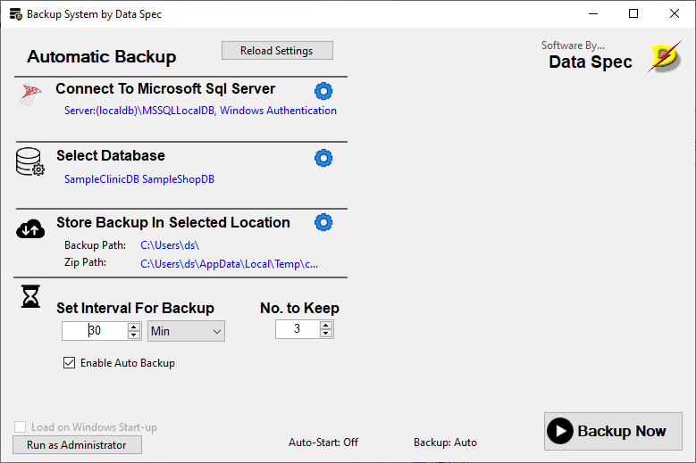
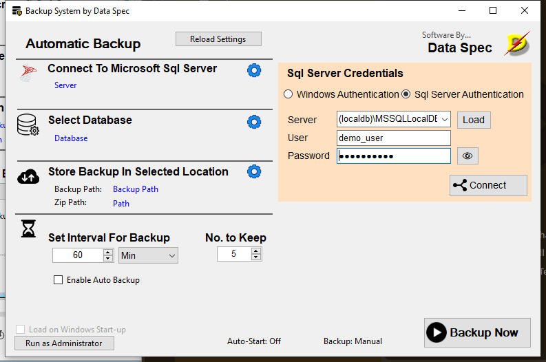
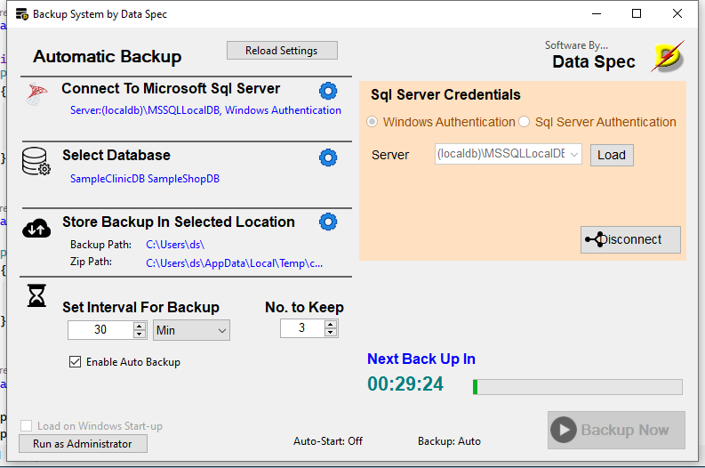
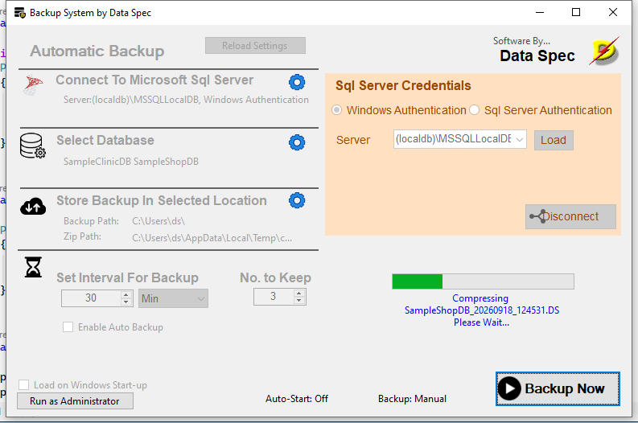
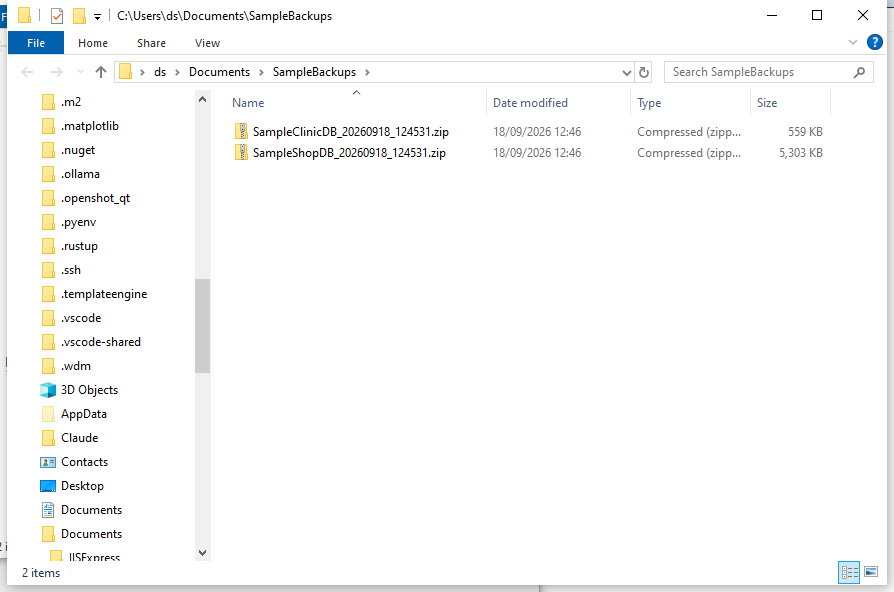

# dsBackup User Guide

This guide walks you through setting up and using dsBackup. No technical
or programming knowledge is needed — if you can use a folder browser, you
can set this up.

## What dsBackup does

dsBackup connects to your SQL Server database, takes a backup, compresses
it into a `.zip` file, and stores it wherever you choose. It can do this
automatically on a schedule, so you don't have to remember to run backups
yourself.

This is especially useful if you're running **SQL Server Express**, which
doesn't come with its own automatic backup scheduler.

## Before you start

You'll need:

- dsBackup installed on the same computer as your SQL Server (or a
  computer that can directly access the SQL Server's backup folder)
- The server name, and either:
  - Windows login access to the SQL Server, or
  - A SQL Server username and password
- A folder where you'd like your backup files stored — ideally on a
  different drive, an external drive, or a network location, so your
  backups don't disappear along with your main computer if something
  goes wrong

## Step 1 — Connect to your SQL Server

When you first open dsBackup, you'll land on the **SQL Server Credentials**
screen.

1. Enter or select your **Server** name. If you're not sure what it's
   called, click **Load** to see a list of SQL Servers dsBackup can find
   on your network.
2. Choose how you log in:
   - **Windows Authentication** — uses your current Windows login. No
     username or password needed.
   - **SQL Server Authentication** — enter the **User** and **Password**
     for your SQL Server login. Click the eye icon (👁) next to the
     password field if you want to check what you typed.

   

3. Click **Connect**.

If the connection succeeds, the button changes to **Disconnect** and the
server name turns blue. If something's wrong, a message box will explain
what happened — double-check the server name and credentials.

## Step 2 — Choose which databases to back up

Click the database icon to open the **Select Database** screen. Tick the
checkbox next to each database you want dsBackup to include in its backup
runs. You can select as many as you like.

## Step 3 — Choose where backups are stored

Click the folder/path icon to open the **Store Backup** screen. Click the
**...** button to browse for a folder, or type a path directly.
This is where the final, compressed `.zip` backup files will be kept —
**forever**, unless you delete them yourself. dsBackup does not
automatically delete your compressed backups.

> **Tip:** choose a folder outside of the computer running SQL Server if
> possible — an external drive or a network share — so a hardware failure
> doesn't take out both your database and your backups at once.

## Step 4 — Set a schedule (optional)

Back on the main screen, you can control how backups run:

- **Enable Auto Backup** — when checked, dsBackup runs backups
  automatically at the interval you set below (in minutes or hours). A
  countdown shows how long until the next run.
- **No. to Keep** — how many of the most recent *raw* backup files to
  keep in SQL Server's own backup folder before older ones are deleted.
  This does **not** affect your compressed `.zip` files in your chosen
  storage folder — those are never automatically deleted.
- **Backup Now** — runs a backup immediately, regardless of the schedule.

## Running a backup

When a backup is running — whether triggered by **Backup Now** or by the
schedule — a progress bar and status message show which database is
currently being processed, and the rest of the window is disabled until
it finishes:

When it's done, you'll find one `.zip` file per database in your chosen
storage folder, named after the database and the date/time of the backup:

## Running automatically when Windows starts

If you want dsBackup to start automatically whenever the computer turns
on:

1. Check **Load on Windows Start-up**.
2. This option only works when dsBackup is running with Administrator
   rights. If the checkbox is disabled, click **Run as Administrator**
   first, then try again.

A status bar at the bottom of the window always shows whether auto-start
is on, whether backups are set to run automatically or manually, and
whether the app is currently running as Administrator.

## Checking backup status

- The bottom-right status bar shows a quick summary of your current
  settings at all times.
- Double-click either of the folder path labels in the window (the SQL
  Server backup path or your chosen storage path) to open that folder
  directly in File Explorer.

## Frequently asked questions

**Where do my backup files end up?**
Two places, briefly and then permanently:
- SQL Server's own backup folder gets a raw backup file first — dsBackup
  keeps only the most recent few of these (see "No. to Keep" above).
- Your chosen storage folder (Step 3) gets the final compressed `.zip`
  file, which stays there permanently.

**Is my password safe?**
Yes — if you use SQL Server Authentication, your password is encrypted
using Windows' own built-in protection before it's saved. It is not
stored in plain text.

**What if a backup fails?**
dsBackup keeps trying the remaining databases even if one fails, and
records what happened. Check the log files or ask whoever manages your
computer to look at the technical details in the
[Programmer Reference](programmerreference.md) if a backup isn't working
as expected.

**Can I close dsBackup and have backups still run?**
No — dsBackup needs to stay open (it can be minimized) for scheduled
backups to run. Use the "Load on Windows Start-up" option so it's always
running in the background after a restart.
